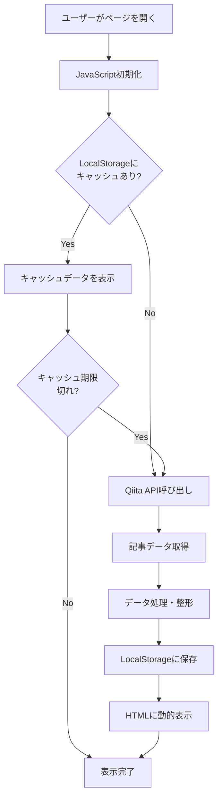
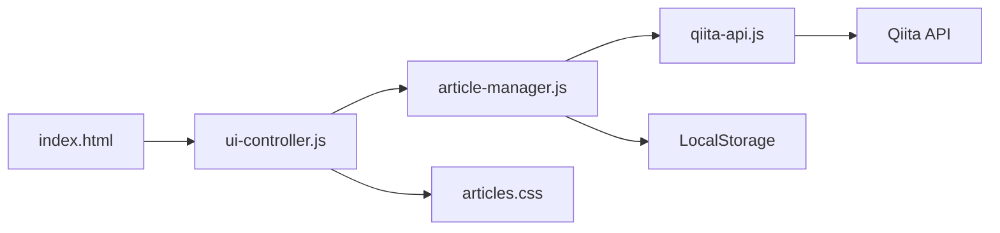
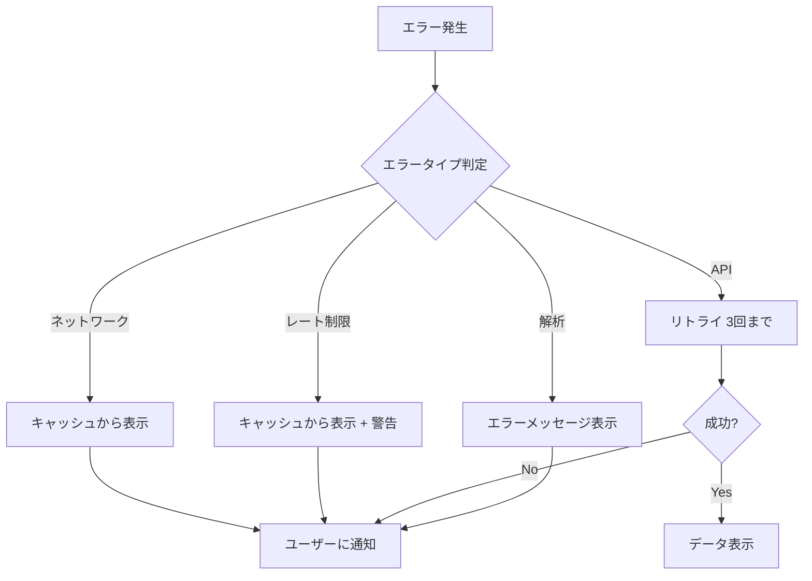

# IBM Bob 記事自動収集機能 実装計画

## 📋 プロジェクト概要

### 目的
IBM Bobに関する日本語記事をQiitaから自動的に収集し、既存のHTMLページに動的に表示する機能を実装する。

### 実装方針
- **アプローチ**: クライアントサイド（ブラウザ上でJavaScript）
- **主要データソース**: Qiita API
- **技術スタック**: Vanilla JavaScript, HTML5, CSS3, LocalStorage

---

## 🏗️ システムアーキテクチャ

### データフロー図



### コンポーネント構成



---

## 📁 ファイル構成

```
IBMBob/
├── index.html              # メインHTMLファイル（更新）
├── js/
│   ├── qiita-api.js       # Qiita API通信モジュール（新規）
│   ├── article-manager.js # 記事データ管理モジュール（新規）
│   └── ui-controller.js   # UI制御モジュール（新規）
├── css/
│   └── articles.css       # 記事表示用スタイル（新規）
├── README.md              # プロジェクト説明（更新）
├── IMPLEMENTATION_PLAN.md # 本ドキュメント（新規）
└── LICENSE                # ライセンス（既存）
```

---

## 🔧 技術仕様

### 1. Qiita API統合

#### API仕様
- **ベースURL**: `https://qiita.com/api/v2`
- **エンドポイント**: `/items`
- **メソッド**: GET
- **認証**: 不要（公開API）
- **レート制限**: 
  - 認証なし: 60リクエスト/時間
  - 認証あり: 1000リクエスト/時間

#### リクエストパラメータ
```javascript
{
  query: "IBM Bob",        // 検索キーワード
  page: 1,                 // ページ番号
  per_page: 20            // 1ページあたりの記事数（最大100）
}
```

#### レスポンスデータ構造
```javascript
[
  {
    id: "記事ID",
    title: "記事タイトル",
    url: "記事URL",
    created_at: "2026-01-20T12:00:00+09:00",
    updated_at: "2026-01-20T12:00:00+09:00",
    likes_count: 15,
    tags: [
      { name: "IBM", versions: [] },
      { name: "AI", versions: [] }
    ],
    user: {
      id: "ユーザーID",
      name: "ユーザー名",
      profile_image_url: "画像URL"
    }
  }
]
```

### 2. データ処理ロジック

#### 検索キーワード戦略
```javascript
const searchKeywords = [
  "IBM Bob",
  "IBMBob",
  "Project Bob",
  "IBM+Bob"
];
```

#### フィルタリング条件
- **言語**: 日本語のみ
- **重複排除**: URL/IDベース
- **関連度フィルタ**: スコア3以上のみ表示
- **除外条件**:
  - タイトルが空
  - URLが無効
  - 削除済み記事
  - IBM Bob関連度が低い記事（スコア3未満）

#### 関連度スコアリング（v1.1.0で追加）
記事とIBM Bobの関連度を0-10のスコアで評価：

**スコアリング基準**:
- タイトルに「IBM Bob」が含まれる: +5点
- タイトルが「IBM Bob」で始まる: +2点（追加）
- タグに「IBM Bob」が含まれる: +3点
- 本文冒頭（500文字）での言及頻度:
  - 3回以上: +3点
  - 1回以上: +2点
- 本文全体での言及頻度:
  - 5回以上: +2点
  - 2回以上: +1点
- いいね数10以上: +1点
- 他のメイントピック（Claude, ChatGPT等）がタイトルにある: -2点

**表示ルール**:
- スコア8-10: 🌟 高関連バッジ + ゴールドボーダー
- スコア5-7: ⭐ 関連バッジ
- スコア3-4: バッジなし
- スコア0-2: 非表示

#### ソート順
1. 関連度スコア降順（高い順）
2. 同スコアの場合は作成日降順（新しい順）

#### データ整形
```javascript
{
  id: string,
  title: string,
  url: string,
  author: string,
  authorUrl: string,
  authorImage: string,
  publishedDate: string,      // "2026年1月20日"形式
  likesCount: number,
  tags: string[],
  excerpt: string             // 最初の100文字
}
```

### 3. キャッシュ戦略

#### LocalStorage構造
```javascript
{
  key: "ibmbob_articles_cache",
  value: {
    timestamp: 1737427200000,           // Unix timestamp
    lastUpdate: "2026-01-21T02:00:00Z", // ISO 8601
    articles: [...],                     // 記事配列
    version: "1.0.0"                    // キャッシュバージョン
  }
}
```

#### キャッシュ戦略
- **有効期限**: 6時間
- **最大サイズ**: 5MB（LocalStorage制限考慮）
- **更新タイミング**:
  1. ページ読み込み時（期限切れの場合）
  2. 手動更新ボタン押下時
  3. エラー発生時（フォールバック）

#### キャッシュ無効化条件
- 期限切れ
- バージョン不一致
- データ破損検出

### 4. UI/UX設計

#### 記事カードデザイン
```
┌─────────────────────────────────────────┐
│ 📝 IBM Bobで開発生産性を向上させる方法    │
│                                         │
│ 👤 山田太郎                              │
│ 📅 2026年1月20日                        │
│ ❤️ 15 いいね                            │
│ 🏷️ IBM, AI, 開発ツール                  │
│                                         │
│ [記事を読む →]                          │
└─────────────────────────────────────────┘
```

#### 状態表示

**ローディング状態**:
```html
<div class="loading-state">
  <div class="spinner"></div>
  <p>🔄 記事を読み込み中...</p>
</div>
```

**エラー状態**:
```html
<div class="error-state">
  <p>⚠️ 記事の取得に失敗しました</p>
  <button class="retry-button">再試行</button>
</div>
```

**空状態**:
```html
<div class="empty-state">
  <p>📭 記事が見つかりませんでした</p>
  <p>後ほど再度お試しください</p>
</div>
```

#### レスポンシブブレークポイント
- **モバイル**: 〜767px
- **タブレット**: 768px〜1023px
- **デスクトップ**: 1024px〜

### 5. エラーハンドリング

#### エラータイプ
```javascript
const ErrorTypes = {
  NETWORK_ERROR: "ネットワークエラー",
  API_ERROR: "API呼び出しエラー",
  RATE_LIMIT: "レート制限超過",
  PARSE_ERROR: "データ解析エラー",
  CACHE_ERROR: "キャッシュエラー"
};
```

#### エラー処理フロー


#### リトライ戦略
- **最大リトライ回数**: 3回
- **リトライ間隔**: 指数バックオフ（1秒、2秒、4秒）
- **タイムアウト**: 10秒

---

## 📊 実装フェーズ

### Phase 1: 基本機能（MVP）
**目標**: 記事の取得と表示

- [ ] Qiita API統合
  - [ ] APIクライアント実装
  - [ ] 記事検索機能
  - [ ] レスポンス処理
- [ ] 記事表示機能
  - [ ] HTMLへの動的挿入
  - [ ] 基本的なスタイリング
- [ ] 基本的なエラーハンドリング
  - [ ] ネットワークエラー対応
  - [ ] 空結果対応

**完了条件**: ページ読み込み時にQiitaから記事を取得し、表示できる

### Phase 2: 機能強化
**目標**: ユーザー体験の向上

- [ ] キャッシュ機能
  - [ ] LocalStorage実装
  - [ ] キャッシュ有効期限管理
  - [ ] キャッシュ更新ロジック
- [ ] UI/UX改善
  - [ ] ローディング表示
  - [ ] エラーメッセージ
  - [ ] 手動更新ボタン
- [ ] レスポンシブ対応
  - [ ] モバイル最適化
  - [ ] タブレット対応

**完了条件**: キャッシュが機能し、快適なユーザー体験を提供できる

### Phase 3: 最適化
**目標**: パフォーマンスと保守性の向上

- [ ] パフォーマンス最適化
  - [ ] 遅延ロード実装
  - [ ] デバウンス処理
  - [ ] 画像最適化
- [ ] 自動更新機能
  - [ ] 定期チェック機能
  - [ ] 新着通知（オプション）
- [ ] コード品質向上
  - [ ] コメント追加
  - [ ] リファクタリング
  - [ ] テスト追加
- [ ] ドキュメント整備
  - [ ] README更新
  - [ ] API仕様書
  - [ ] 使用方法ガイド

**完了条件**: 本番環境で安定稼働し、保守しやすいコードベース

---

## 🔐 セキュリティ考慮事項

### XSS対策
```javascript
// HTMLエスケープ関数
function escapeHtml(text) {
  const map = {
    '&': '&',
    '<': '<',
    '>': '>',
    '"': '"',
    "'": '&#039;'
  };
  return text.replace(/[&<>"']/g, m => map[m]);
}
```

### CORS対応
- Qiita APIは公開APIでCORS対応済み
- 追加の設定は不要

### データ検証
- APIレスポンスの型チェック
- 必須フィールドの存在確認
- URLの妥当性検証

### レート制限対策
- キャッシュ機能による不要なリクエスト削減
- リトライ時の指数バックオフ
- ユーザーへの適切な通知

---

## 🧪 テスト計画

### 単体テスト
- [ ] API通信関数
- [ ] データ処理関数
- [ ] キャッシュ管理関数
- [ ] UI更新関数

### 統合テスト
- [ ] API → データ処理 → UI表示フロー
- [ ] キャッシュ → UI表示フロー
- [ ] エラー → フォールバック → UI表示フロー

### E2Eテスト
- [ ] 初回ページ読み込み
- [ ] キャッシュからの読み込み
- [ ] 手動更新
- [ ] エラー発生時の挙動

### ブラウザ互換性テスト
- [ ] Chrome（最新版）
- [ ] Firefox（最新版）
- [ ] Safari（最新版）
- [ ] Edge（最新版）

### パフォーマンステスト
- [ ] ページ読み込み時間
- [ ] API呼び出し時間
- [ ] レンダリング時間
- [ ] メモリ使用量

---

## 📈 成功指標（KPI）

### 技術指標
- **ページ読み込み時間**: < 2秒
- **API応答時間**: < 1秒
- **キャッシュヒット率**: > 80%
- **エラー率**: < 1%

### ユーザー体験指標
- **記事表示成功率**: > 99%
- **UI応答性**: < 100ms
- **モバイル対応**: 完全対応

---

## 🚀 デプロイメント

### デプロイ手順
1. コードレビュー
2. テスト実行
3. ビルド（必要に応じて）
4. GitHub Pagesへプッシュ
5. 動作確認

### ロールバック計画
- Git履歴から前バージョンに戻す
- キャッシュクリア手順の提供

---

## 📚 参考資料

### API ドキュメント
- [Qiita API v2 ドキュメント](https://qiita.com/api/v2/docs)

### 技術記事
- [LocalStorageの使い方](https://developer.mozilla.org/ja/docs/Web/API/Window/localStorage)
- [Fetch APIの使い方](https://developer.mozilla.org/ja/docs/Web/API/Fetch_API)

### デザインリファレンス
- IBM Design Language
- Material Design

---

## 📝 変更履歴

| 日付 | バージョン | 変更内容 | 担当者 |
|------|-----------|---------|--------|
| 2026-01-21 | 1.0.0 | 初版作成 | - |

---

## 🤝 貢献者

- プロジェクトオーナー: @ayatokura

---

## 📄 ライセンス

このプロジェクトのライセンスについては、LICENSEファイルを参照してください。